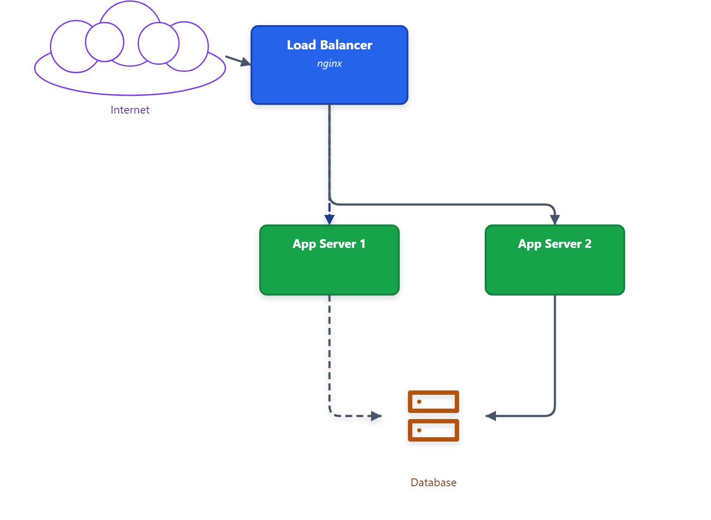
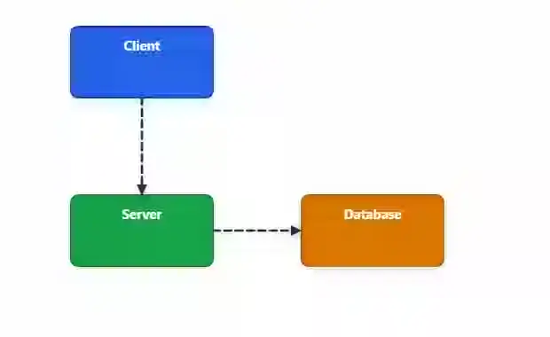

# VisualDesigner v1.3.1

A browser-based visual diagram editor: draw shapes, text, and connectors,
then export them as a static image or an animated video. No hand-writing
SVG or HTML required.

Features include rectangles/ellipses/polygons/clouds/pills, vendored device
icons, and uploaded images (PNG/JPG/WebP/GIF/SVG); text bound to shapes
(title/subtitle); connectors with straight/orthogonal/curved routing, each
with draggable control-point handles to reshape the path, dashed "marching
ants" animation, gradients and arrowheads; drop shadows on shapes, text, and
connectors; layers with z-order/lock/hide; grouping; multi-select with
align/distribute; undo/redo; copy/paste; snap-to-grid; a one-click board
reset; and export to SVG, PNG, WebM, MP4, and animated WebP.

## 1. Install the prerequisite: Node.js

This app is built with Node.js. If you already have it installed (check by
opening a terminal and running `node -v`), skip to step 2.

**Windows:**
1. Go to [nodejs.org](https://nodejs.org/)
2. Download the **LTS** version installer and run it, keeping the default options
3. Restart any open terminal windows so they pick up the change

**macOS:**
1. Go to [nodejs.org](https://nodejs.org/) and download the **LTS** installer, or
2. If you have [Homebrew](https://brew.sh/): `brew install node`

**Linux:**
- Use your distribution's package manager (e.g. `sudo apt install nodejs npm`
  on Ubuntu/Debian), or see [nodejs.org](https://nodejs.org/) for other options

To confirm it worked, open a new terminal and run:
```
node -v
npm -v
```
Both should print a version number.

## 2. Get the project

**Option A — Git** (if you have [Git](https://git-scm.com/) installed):
```
git clone https://github.com/Code-Yeti/VisualDesigner.git
cd VisualDesigner
```

**Option B — Download ZIP** (no Git required):
1. Go to https://github.com/Code-Yeti/VisualDesigner
2. Click the green **Code** button → **Download ZIP**
3. Extract the ZIP file anywhere on your computer
4. Open that extracted folder

## 3. Run the app

**Windows:** double-click `run.bat` in the project folder. It installs
dependencies (first run only), builds the app, starts a local server, and
opens it in your default browser automatically. To stop the app, close the
"VisualDesigner server" window it opens.

**macOS/Linux, or if you'd rather use a terminal:**
```
npm install       # first time only
npm run build
npm run preview
```
Then open the URL it prints (usually http://localhost:4173) in your browser.

> Animated video export (MP4 and animated WebP) only works when the app is
> served this way (`run.bat`, or `npm run build && npm run preview`) — not
> via `npm run dev`. Everything else works the same either way.

### For active development

If you're going to be editing the code and want hot-reload instead of
re-running the build each time:
```
npm install
npm run dev
```
Then open http://localhost:5173.

## Updating the app

**Regular (Node.js) install** — pull the latest code and rebuild:
```
git pull
npm install
npm run build
npm run preview
```
(Or just re-run `run.bat` on Windows — it reinstalls/rebuilds automatically.)

**Docker install** — see [Updating an existing container](#updating-an-existing-container) below.

---

## 🐳 Run with Docker


If you have [Docker](https://www.docker.com/) installed, no Node.js setup is
needed at all — the whole app builds and runs inside a container.

### Build and run

```
docker build -t visualdesigner .
docker run -d --name visualdesigner -p <HOST_PORT>:80 visualdesigner
```
Replace `<HOST_PORT>` with whichever port on your machine you want the app
reachable on — e.g. `docker run -d --name visualdesigner -p 8080:80 visualdesigner`,
then open http://localhost:8080. Pick a port that isn't already in use by
something else on your computer.

### Updating an existing container

Say you already cloned the repo and built/ran a container earlier, and want
to pick up the latest changes from GitHub. From the project folder:

```
# 1. Pull the latest source from GitHub
git pull

# 2. Stop the running container
docker stop visualdesigner

# 3. Remove the stopped container (the old image's built code, not the source)
docker rm visualdesigner

# 4. Rebuild the image with the updated source
docker build -t visualdesigner .

# 5. Start a fresh container from the rebuilt image
docker run -d --name visualdesigner -p <HOST_PORT>:80 visualdesigner
```
Use the same `<HOST_PORT>` you picked originally to keep the same URL. Steps
2–3 are necessary because a container is a frozen snapshot of the image at
the time it was created — rebuilding the image in step 4 doesn't change any
container already running from the old one; it has to be replaced.

## Using the app

- **Draw a shape:** click a shape tool in the toolbar (Rectangle, Ellipse,
  Polygon, Cloud, Pill, or pick a device icon from the dropdown), then
  click-drag on the canvas. A plain click places a default-sized shape.
- **Upload an image or icon:** click "Upload Image" in the toolbar and choose
  a PNG, JPG, WebP, GIF, or SVG file. It's placed in the middle of the current
  view, scaled to fit, and can be moved/resized like any other shape; use
  "Replace image" in its Properties panel to swap the file without losing its
  position or size.
- **Add text:** use the Text tool to place standalone text, or double-click
  inside a shape to give it a title (double-click again for a subtitle).
- **Connect shapes:** switch to the Connect tool, then drag from one shape
  to another. Hover a shape to see its connection points; dragging from any
  point on a shape's edge (not just the default ones) creates a custom
  connection point there.
- **Shape a connector's path:** select an orthogonal or bezier connector to
  see its control-point handles. Orthogonal: drag the bend handle to
  reposition it, double-click anywhere on the path to add another bend,
  double-click a handle to remove it. Bezier: drag either of the two curve
  handles, same as a typical pen-tool bezier editor.
- **Select and edit:** use the Select tool to click (shift-click to add to
  the selection, or drag a box over empty canvas to select everything
  inside it) — the Properties panel on the right lets you change fill,
  stroke, routing, animation, drop shadow, and more depending on what's
  selected. With multiple objects selected, you also get alignment and
  distribute buttons.
- **Drop shadow:** every shape, text, and connector has an "Effects" section
  in its Properties panel with a drop-shadow toggle. Turning it on applies a
  sensible default (matching `network.htm`'s own shadow); offset, blur,
  color, and opacity are all then adjustable.
- **Layers:** the panel on the left lists every object; drag to reorder,
  or use the arrows/eye/lock icons for z-order, visibility, and locking.
- **Canvas settings:** click empty canvas (nothing selected) to see canvas
  size, background, and grid/snap settings in the right panel — including a
  red **Reset board** button that clears everything (behind a confirmation
  dialog; undoable with Ctrl+Z right after).
- **Save/Load:** the toolbar's Save/Load buttons write/read a `.json`
  project file. The app also autosaves to your browser's local storage and
  offers to restore it next time you open the page.
- **Export:** the Export button in the toolbar handles static SVG/PNG;
  "Export Video" handles animated WebM/MP4/WebP with configurable duration,
  fps, and scale.

**Keyboard shortcuts:** Delete/Backspace, Ctrl+Z/Ctrl+Y (undo/redo), Ctrl+C/
Ctrl+V (copy/paste), Ctrl+D (duplicate), Ctrl+G (group), arrow keys (nudge,
hold Shift for 10px steps), Ctrl+S (save).

## Examples

A static architecture diagram exported as PNG (icon boxes, bound
title/subtitle text, orthogonal + straight connectors, drop shadows on
shapes, an icon, and connectors — including a perfectly vertical connector,
which used to disappear when a drop shadow was applied before this was
fixed):



A simpler client/server/database flow exported as an animated WebP, showing
the dashed "marching ants" connector animation plus drop shadows on both an
exactly vertical and an exactly horizontal connector:



## More detail

See [CLAUDE.md](CLAUDE.md) for architecture notes, the full list of
implemented features, and known limitations.
